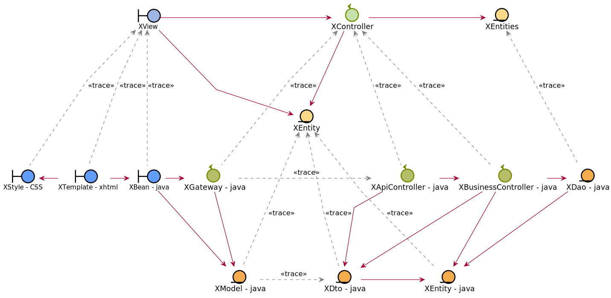

= AGRIM MANAGER
Doc Writer - ilya

== Status

image:https://travis-ci.org/Ruskab/agrimManager.svg?branch=develop["Build Status", link="https://travis-ci.org/erebor/asciidoctor"]
image:https://sonarcloud.io/api/project_badges/measure?project=ilya.dev%3AagrimManager&metric=alert_status["Quality Gate"]
image:https://bettercodehub.com/edge/badge/Ruskab/agrimManager?branch=develop["Better hub", link="https://bettercodehub.com/"]

image:https://github.com/Ruskab/agrimManager/workflows/Unit%20&%20Integration%20Tests/badge.svg["Unit & Integration Tests", link="https://github.com/Ruskab/agrimManager/actions?query=workflow%3A%22Unit+%26+Integration+Tests%22"]

image:https://github.com/Ruskab/agrimManager/workflows/API%20contoller%20aceptance%20tests%20in%20deployed%20application/badge.svg["API aceptance tests", link="https://github.com/Ruskab/agrimManager/actions?query=workflow%3A%22API+contoller+aceptance+tests+in+deployed+application%22"]

https://www.notion.so/Trabajo-fin-de-grado-a8d44826c2494e15bcb235fc1019938d#cd3ccf181d9c4a1b9253416cd9b74f57[Memoria del proyecto (Español)]

https://www.notion.so/Trabajo-fin-de-grado-a8d44826c2494e15bcb235fc1019938d#cd3ccf181d9c4a1b9253416cd9b74f57[Presentación del proyecto (Español)]

== Used technologies

image::documentation/4implementation/software_ecosystem/Heramientas_Ecosistema.svg[ecosystem]

== Continuos Integration & Continuos Delivery (CI/CD)

image::documentation/4implementation/ci_cd/continuos_integration.svg[continuous integration]

== Design

=== Analysis to Design trazability

//https://www.plantuml.com/plantuml/proxy?src=https://raw.githubusercontent.com/Ruskab/agrimManager/develop/documentation/3design/architecture/puml/usecase_design_template.puml

=== API REST structured in layers
image::http://www.plantuml.com/plantuml/proxy?src=https://raw.githubusercontent.com/Ruskab/agrimManager/develop/documentation/3design/architecture/puml/app-web-architecture-packages.puml&fmt=svg[packages REST]

=== Persisted entities model
image::http://www.plantuml.com/plantuml/proxy?src=https://raw.githubusercontent.com/Ruskab/agrimManager/develop/documentation/3design/architecture/puml/persistance/persistance_jpa_orm_model.puml&fmt=svg[packages REST]

image::https://profile-counter.glitch.me/Ruskab/count.svg[visitas]

Autor: Ilya Kabushko.
