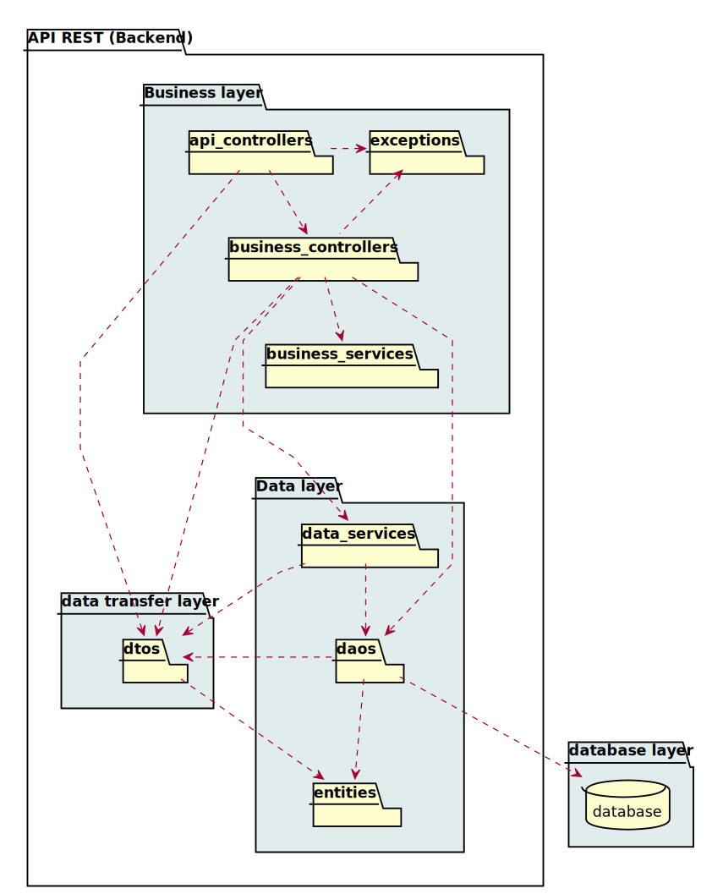

= AGRIM MANAGER
Doc Writer - ilya

== Status

image:https://travis-ci.org/Ruskab/agrimManager.svg?branch=develop["Build Status", link="https://travis-ci.org/erebor/asciidoctor"]
image:https://sonarcloud.io/api/project_badges/measure?project=ilya.dev%3AagrimManager&metric=alert_status["Quality Gate"]
image:https://bettercodehub.com/edge/badge/Ruskab/agrimManager?branch=develop["Better hub", link="https://bettercodehub.com/"]

image:https://github.com/Ruskab/agrimManager/workflows/Unit%20&%20Integration%20Tests/badge.svg["Unit & Integration Tests", link="https://github.com/Ruskab/agrimManager/actions?query=workflow%3A%22Unit+%26+Integration+Tests%22"]

image:https://github.com/Ruskab/agrimManager/workflows/API%20contoller%20aceptance%20tests%20in%20deployed%20application/badge.svg["API aceptance tests", link="https://github.com/Ruskab/agrimManager/actions?query=workflow%3A%22API+contoller+aceptance+tests+in+deployed+application%22"]

== Used tecnologies

image::documentation/4implementation/software_ecosystem/Heramientas_Ecosistema.svg[ecosystem]

== Continuos Integration & Continuos Delivery (CI/CD)

image::documentation/4implementation/ci_cd/continuos_integration.svg[continuous integration]

== Design

=== Class desgin
image::documentation/3design/architecture/svg/design.svg[Diseño de caso de uso]

=== API REST structured in layers

Autor: Ilya Kabushko.
