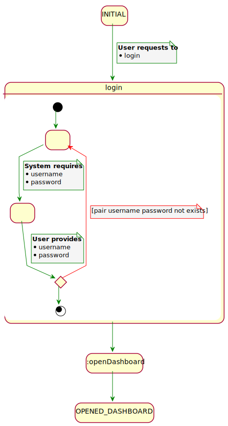
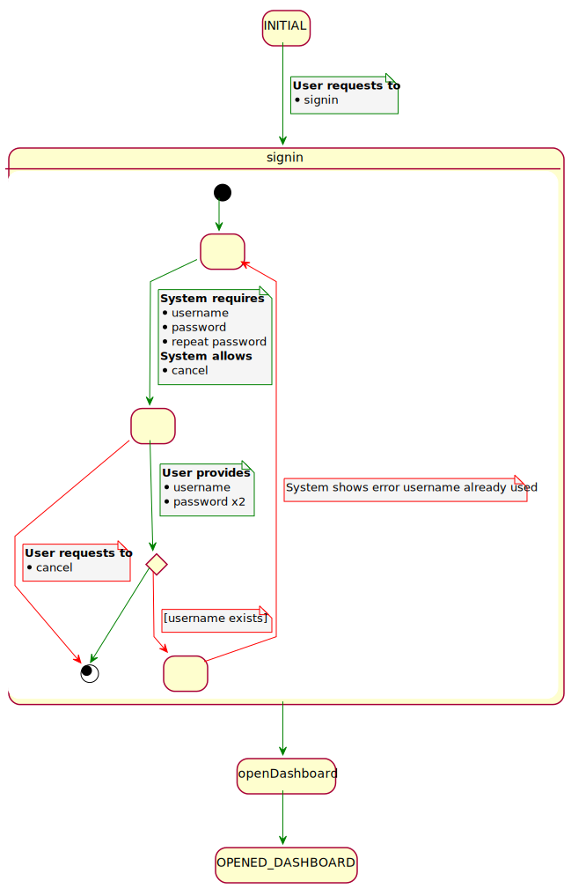
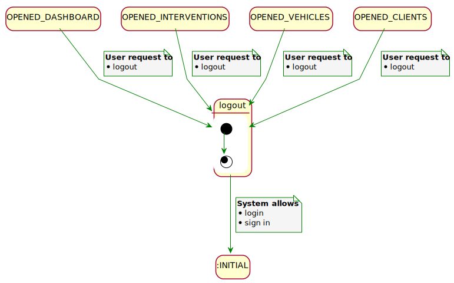
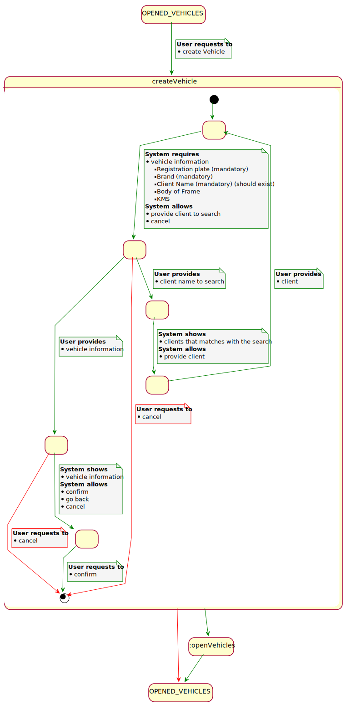
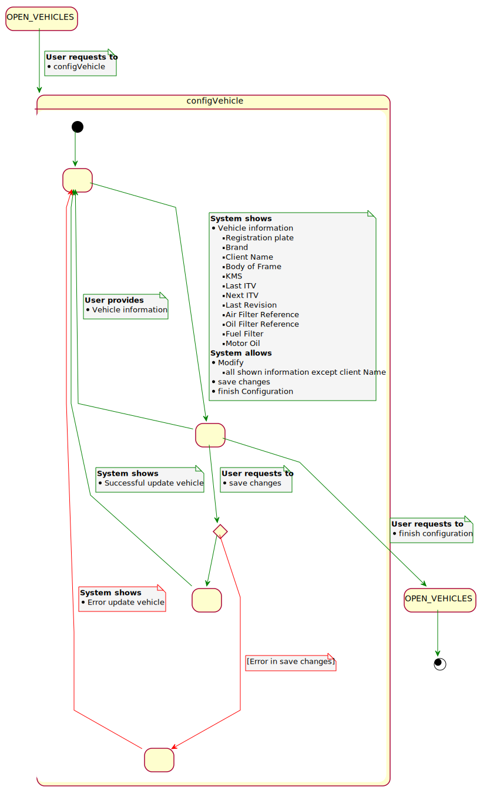
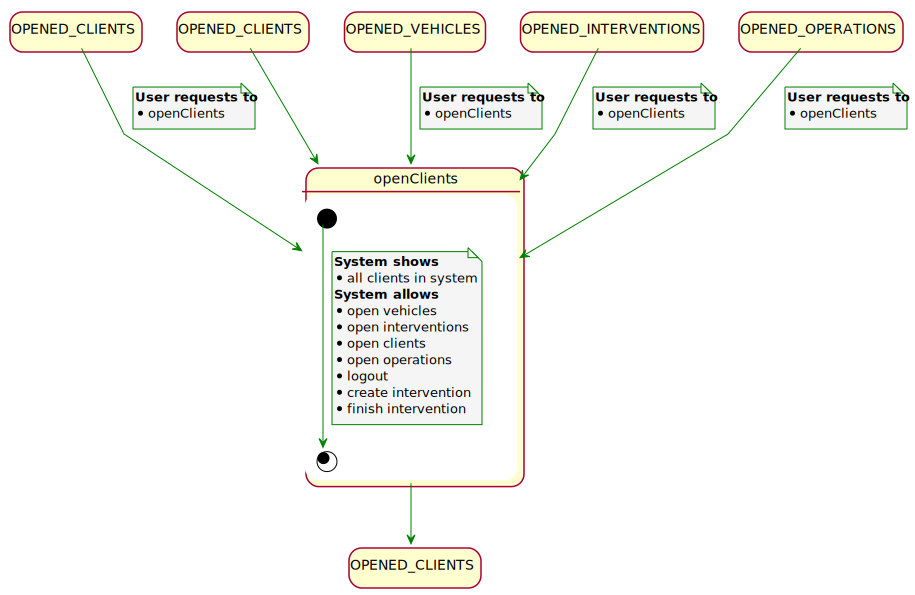
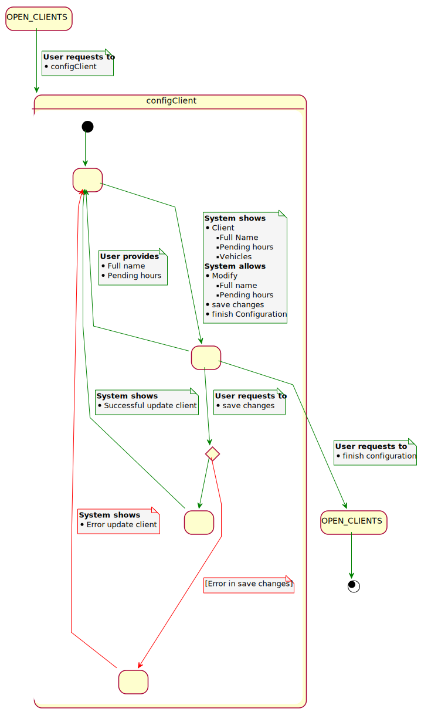
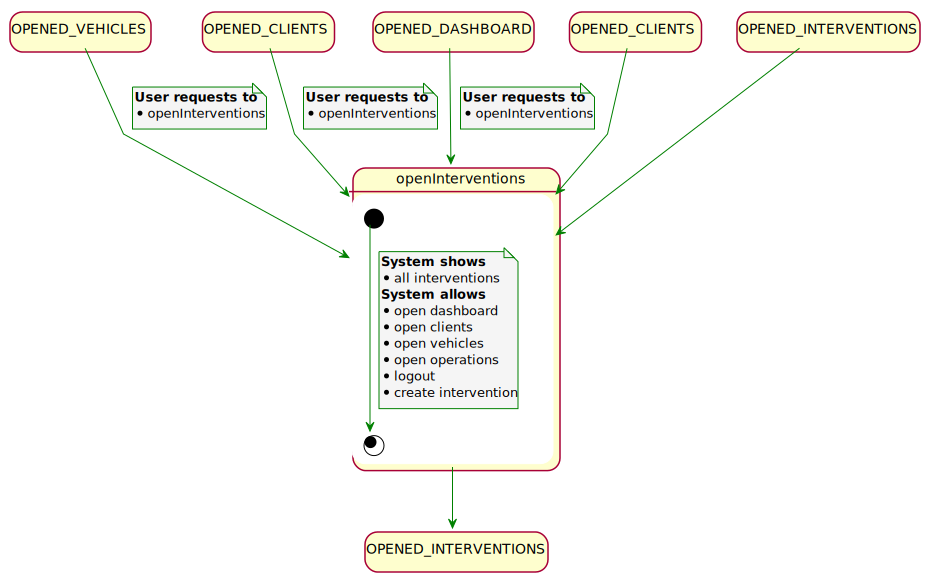
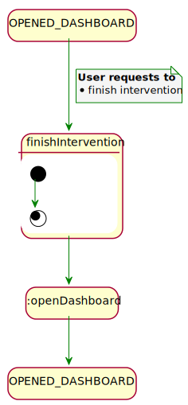

= USE CASES SPECIFICATIONS

25 use cases

[#_index]
== Index

<<_general>>

<<_vehicles>>

<<_clients>>

<<_interventions>>

<<_mechanics>>

[#_general]
== General

=== Log in

<<_index>>

=== Sign in

<<_index>>

=== Log out

<<_index>>

=== open Dashboard
image::svg/openDashboard.svg[]
<<_index>>

[#_vehicles]
== Vehicles management

=== open Vehicles
image::svg/openVehicles.svg[]
<<_index>>

=== create vehicle

<<_index>>

=== open vehicle

<<_index>>

[#_clients]
== Clients management

=== open Clients

<<_index>>

=== open client

<<_index>>

[#_interventions]
== Interventions management
<<_index>>

== Open interventions

<<_index>>

[#_createIntervention]
== create intervention
image::svg/createIntervention.svg[]
<<_index>>

== Finish intervention

<<_index>>

[#_mechanics]
== Mechanics management
<<_index>>

