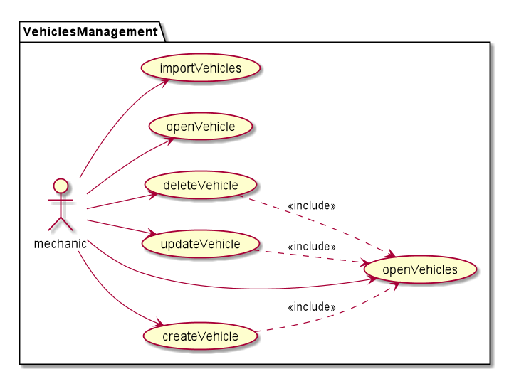
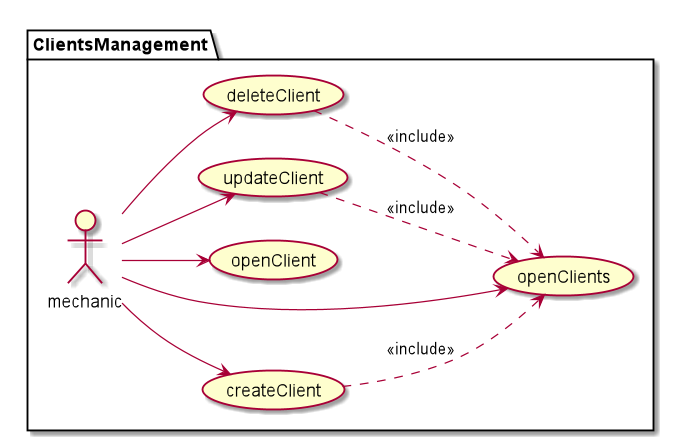
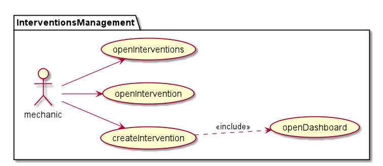
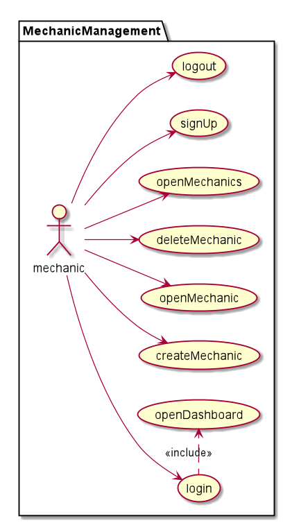

= USE CASES

[#_vehicles]
== Vehicles management

<<_index>>

[#_clients]
== Clients management

<<_index>>

[#_interventions]
== Interventions management

<<_index>>

[#_mechanics]
== Mechanics management

<<_index>>

