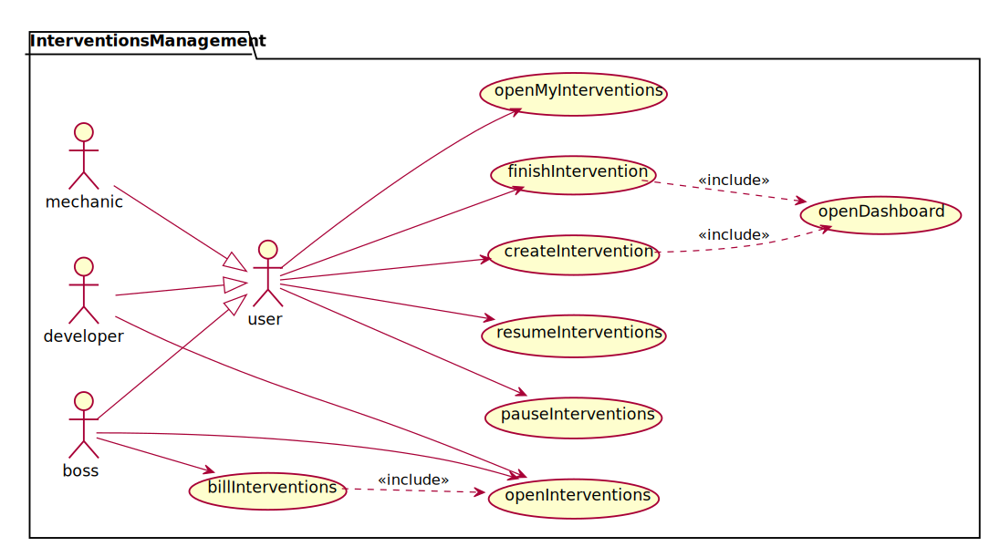
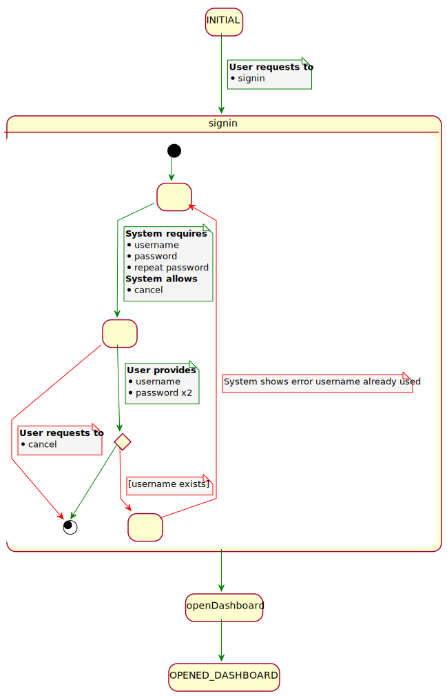
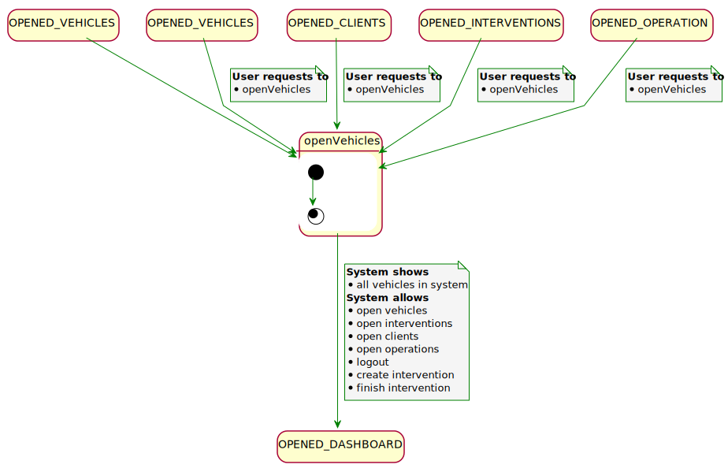
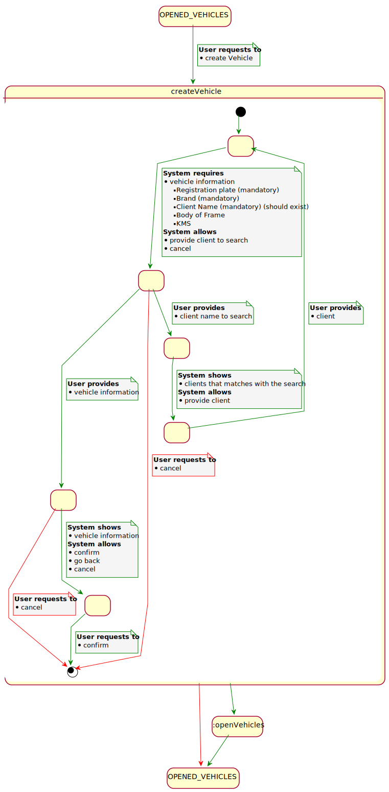

[#_index]
== Index
* <<_usecases>>
** <<_clientUsecases>>
** <<_interventionUsecases>>
** <<_mechanicUsecases>>
** <<_vehicleUseCases>>
* <<_contextDiagram>>
* <<_usecasesspecification>>
** <<_login>>
** <<_signin>>
** <<_openDashboard>>
** <<_openClients>>
** <<_openClient>>
** <<_createClient>>
** <<_updateClient>>
** <<_openVehicles>>
** <<_openVehicle>>
** <<_createVehicle>>
** <<_updateVehicle>>
** <<_openInterventions>>
** <<_createIntervention>>
** <<_finishIntervention>>
* <<_userinterfaces>>

[#_usecases]
== usecases

[#_clientUsecases]
=== clientUsecases

image::usecases/svg/clientUsecases.svg[]
<<_index>>

[#_interventionUsecases]
=== interventionUsecases

<<_index>>

[#_mechanicUsecases]
=== mechanicUsecases

image::usecases/svg/mechanicUsecases.svg[]
<<_index>>

[#_vehicleUseCases]
=== vehicleUseCases

image::usecases/svg/vehicleUseCases.svg[]
<<_index>>

[#_contextDiagram]
== contextDiagram
image::contextdiagram/svg/contextDiagram.svg[]

[#_usecasesspecification]
== Use cases specification

[#_login]
== usecasesspecification

<<_index>>

[#_signin]
== login

<<_index>>

[#_openDashboard]
== signin

image::usecasesspecification/svg/openDashboard.svg[]
<<_index>>

[#_openClients]
== openDashboard

image::usecasesspecification/svg/openClients.svg[]
<<_index>>

[#_openClient]
== openClients

image::usecasesspecification/svg/openClient.svg[]
<<_index>>

[#_createClient]
== openClient

image::usecasesspecification/svg/createClient.svg[]
<<_index>>

[#_updateClient]
== createClient

image::usecasesspecification/svg/updateClient.svg[]
<<_index>>

[#_openVehicles]
== updateClient

<<_index>>

[#_openVehicle]
== openVehicles

image::usecasesspecification/svg/openVehicle.svg[]
<<_index>>

[#_createVehicle]
== openVehicle

<<_index>>

[#_updateVehicle]
== createVehicle

image::usecasesspecification/svg/updateVehicle.svg[]
<<_index>>

[#_openInterventions]
== updateVehicle

<<_index>>

[#_createIntervention]
== openInterventions

image::usecasesspecification/svg/createIntervention.svg[]
<<_index>>

[#_finishIntervention]
== createIntervention

image::usecasesspecification/svg/finishIntervention.svg[]
<<_index>>

== finishIntervention

[#_userinterfaces]
== Webmap
