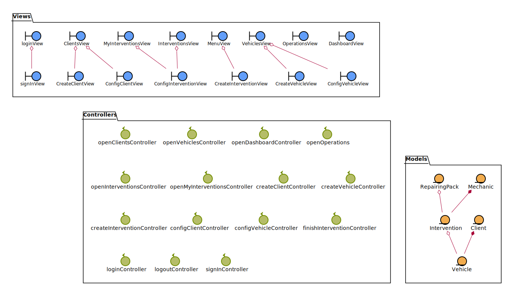
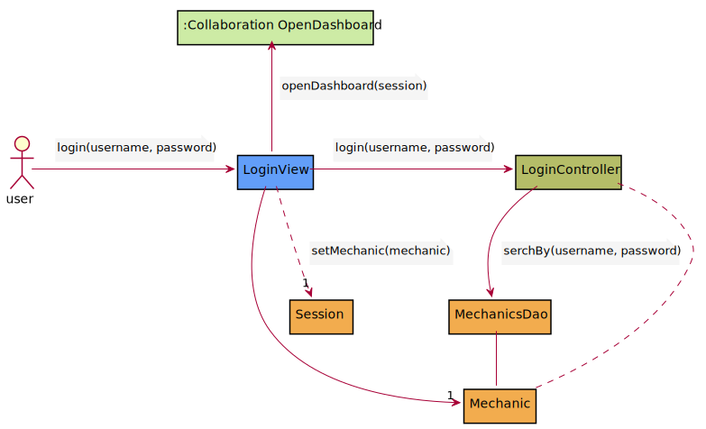
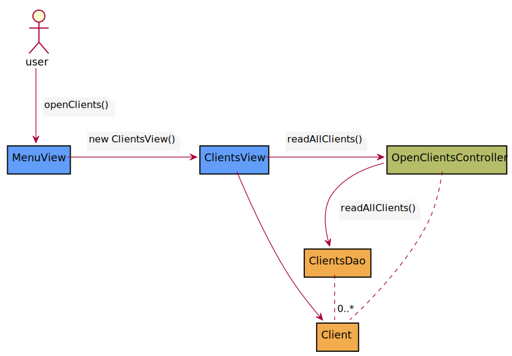

= Analysis View

[#_index]
== Index
* <<_clases>>
* <<_packages>>
* <<_usecaseanalysis>>
** <<_login>>
** <<_openDashboard>>
** <<_openClients>>
** <<_openClient>>
** <<_createIntervention>>

[#_clases]
== classes

<<_index>>

[#_packages]
== packages

[#_usecaseanalysis]
== usecase analysis

[#_login]
=== login
image::usecaseanalysis/clases/svg/login.svg[]

<<_index>>

[#_openDashboard]
=== openDashboard

image::usecaseanalysis/clases/svg/openDashboard.svg[]
image::usecaseanalysis/collaboration/svg/openDashboard.svg[]
<<_index>>

[#_openClients]
=== openClients

image::usecaseanalysis/clases/svg/openClients.svg[]

<<_index>>

[#_openClient]
=== openClient

image::usecaseanalysis/clases/svg/openClient.svg[]
image::usecaseanalysis/collaboration/svg/openClient.svg[]
<<_index>>

[#_createIntervention]
=== createIntervention

image::usecaseanalysis/clases/svg/createIntervention.svg[]
image::usecaseanalysis/collaboration/svg/createIntervention.svg[]
<<_index>>

