= Analysis view

[#_index]
== Index

* <<_Architecture>>
* <<_UserCaseAnalysis>>
* <<_PackageAnalysis>>

[#_Architecture]
== Architecture Analysis
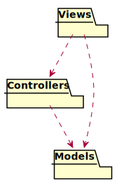

<<_index>>

[#_UserCaseAnalysis]
== Use cases analysis

configClient

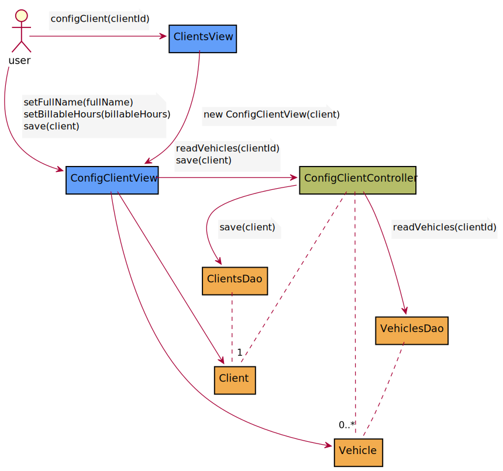

configVehicle

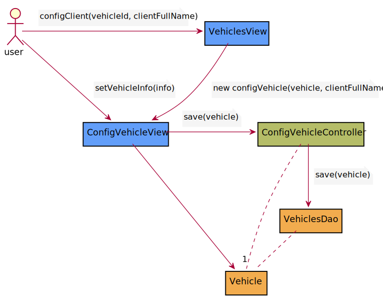

createClient

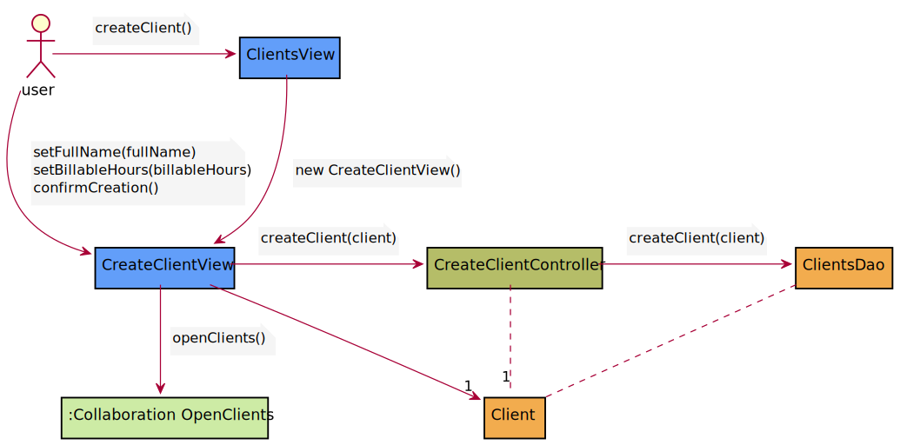

createIntervention

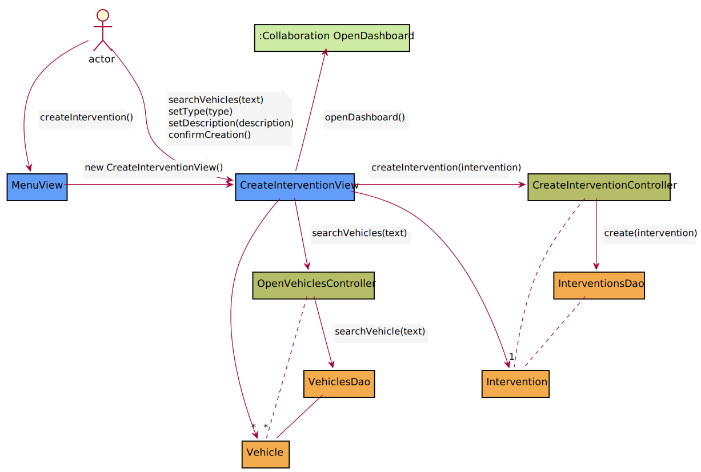

createVehicle

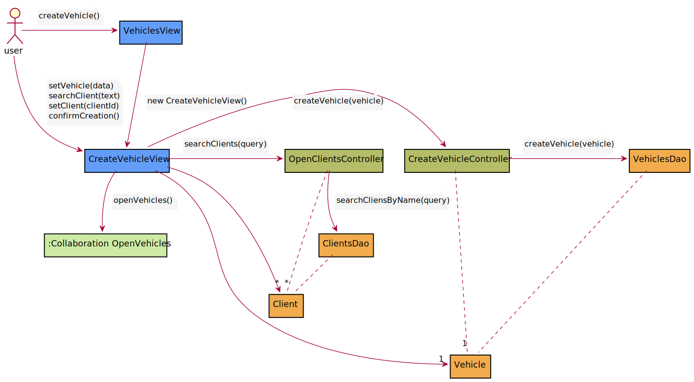

finishIntervention

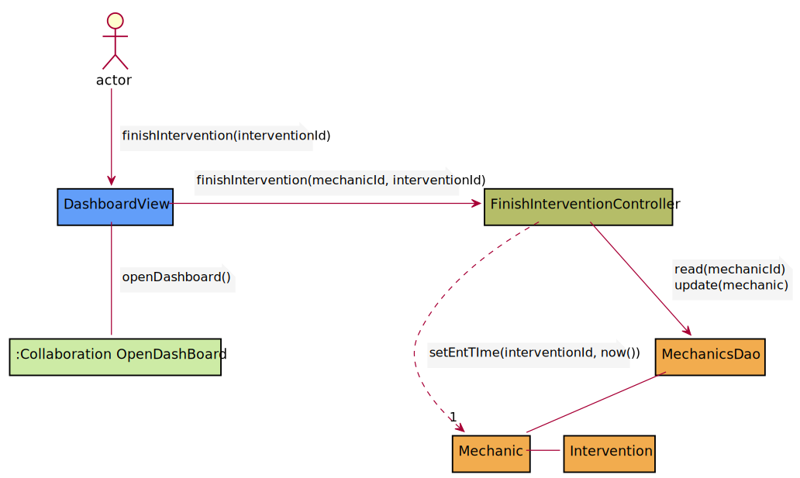

login

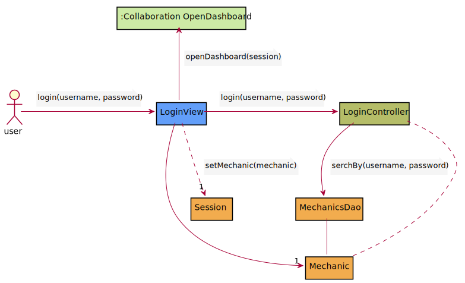

logout

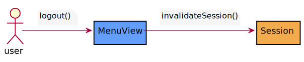

openClients

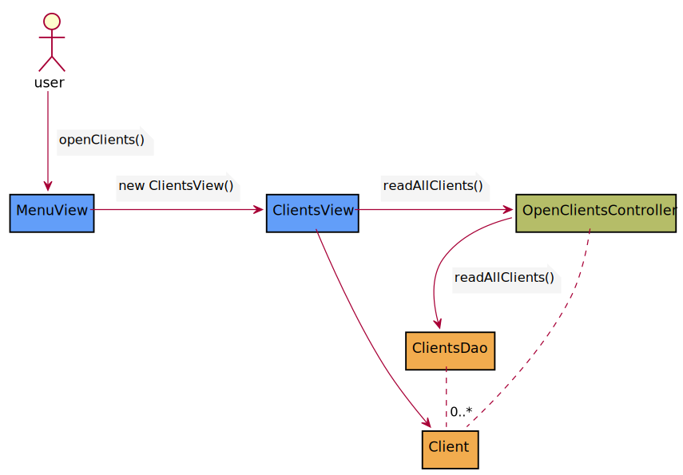

openDashboard

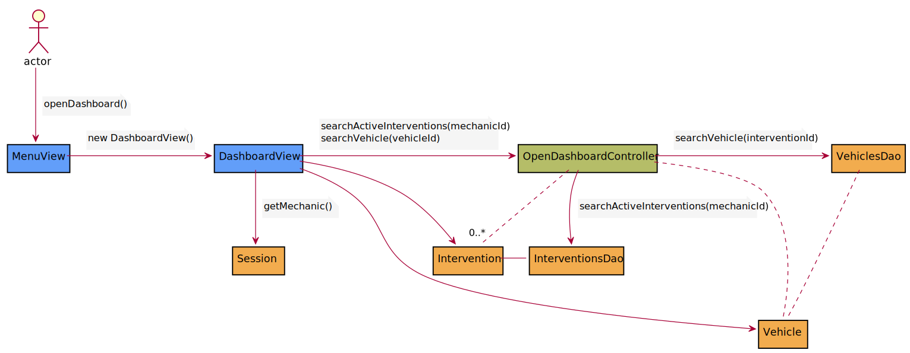

openInterventions

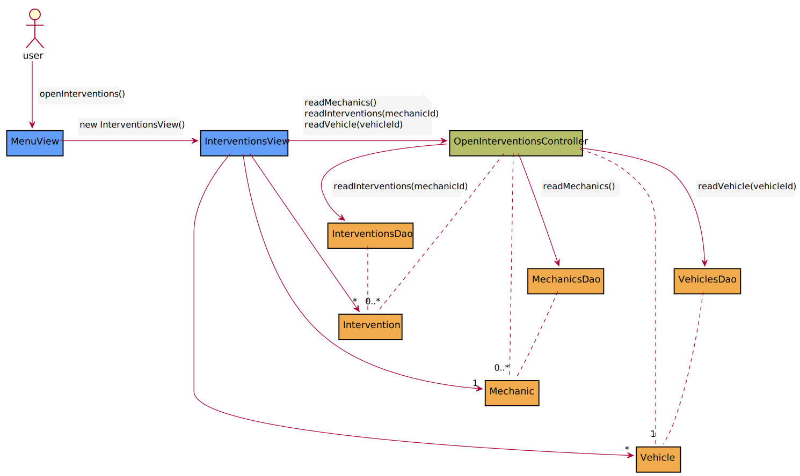

openMyInterventions

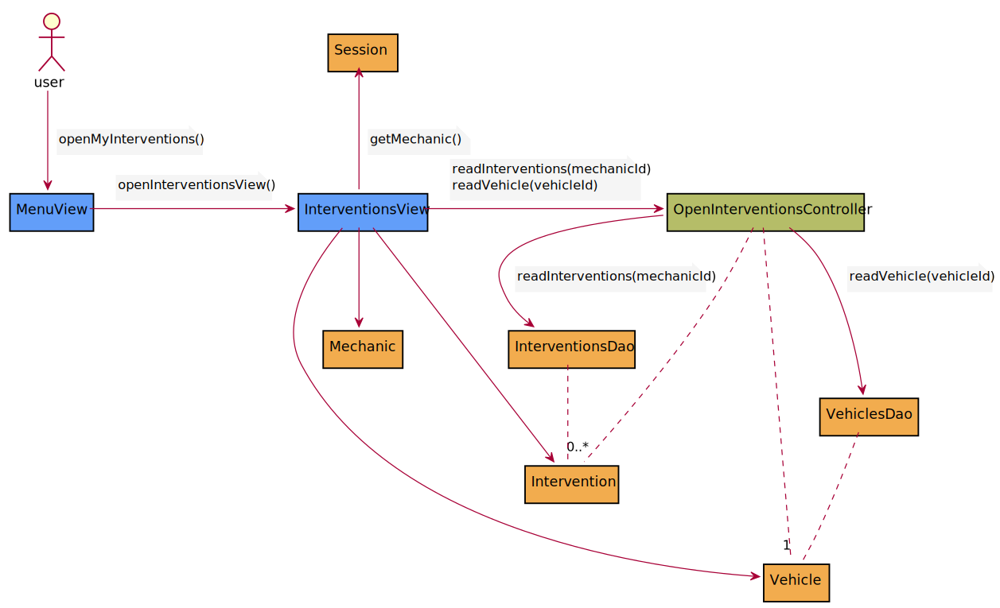

openOperations

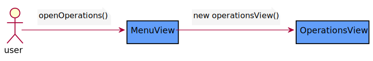

openVehicles

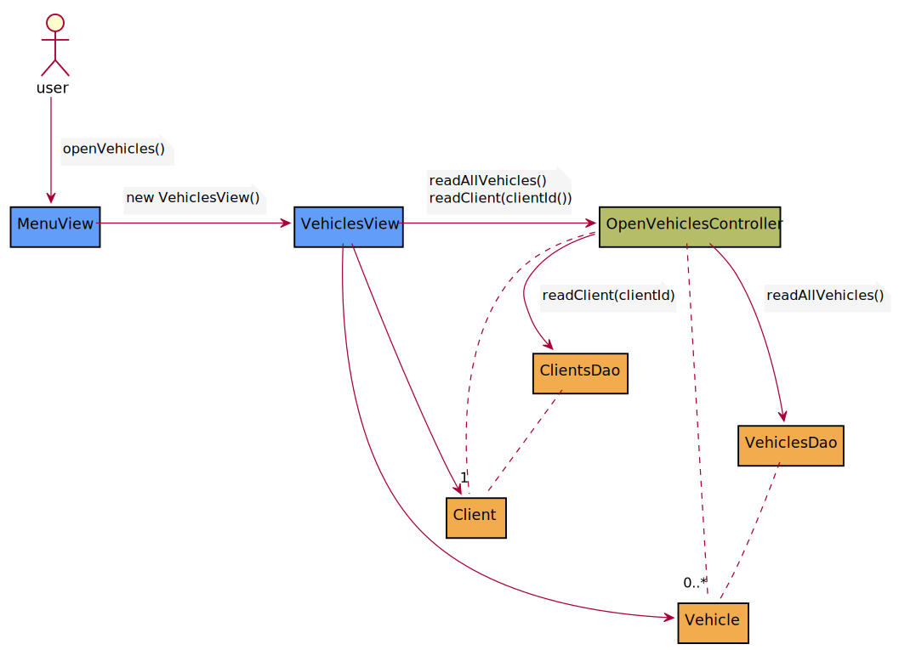

signin

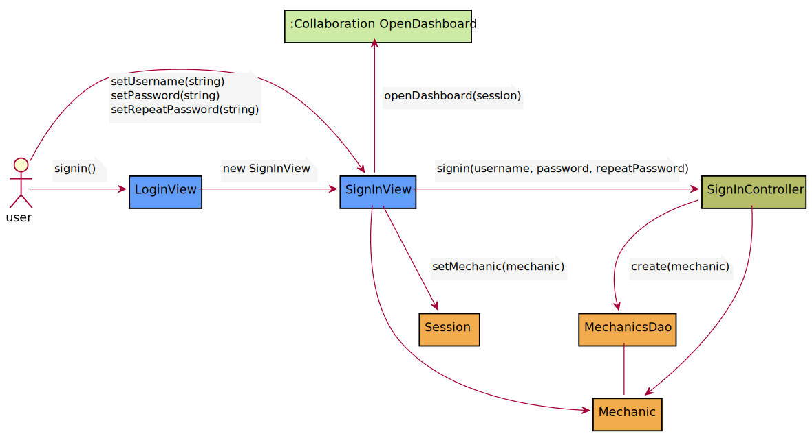

<<_index>>

[#_PackageAnalysis]
== Package analysis

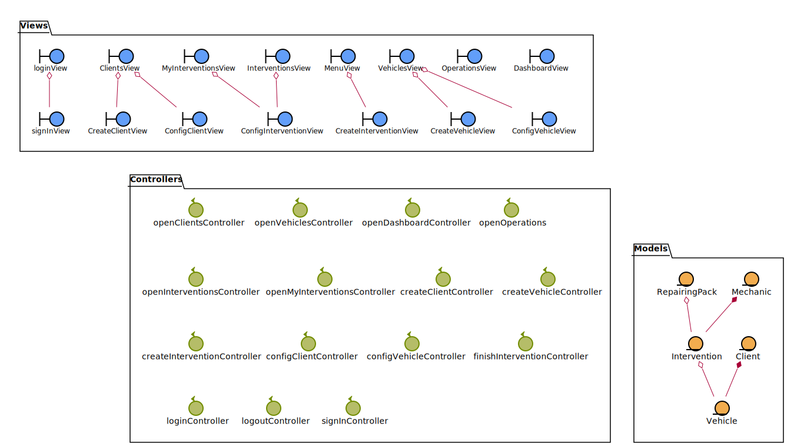

<<_index>>
