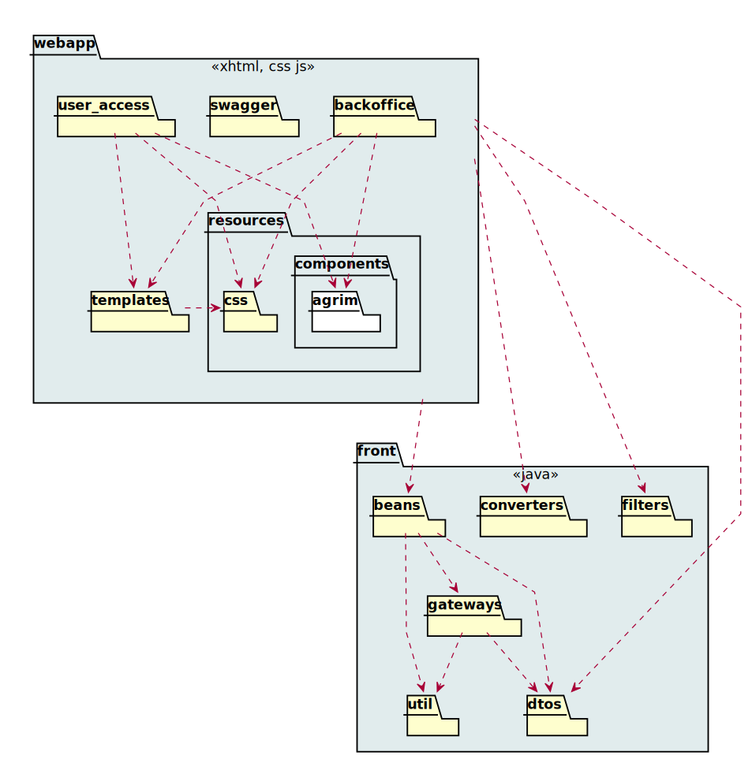
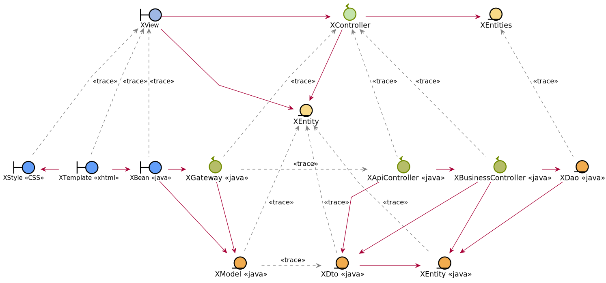
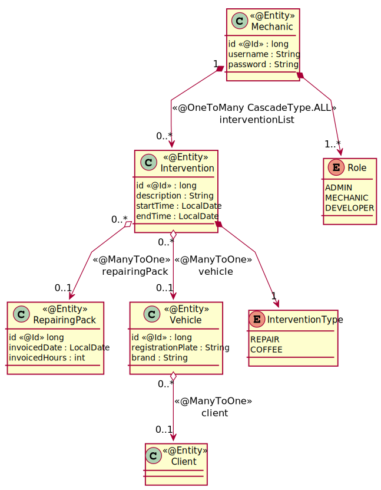
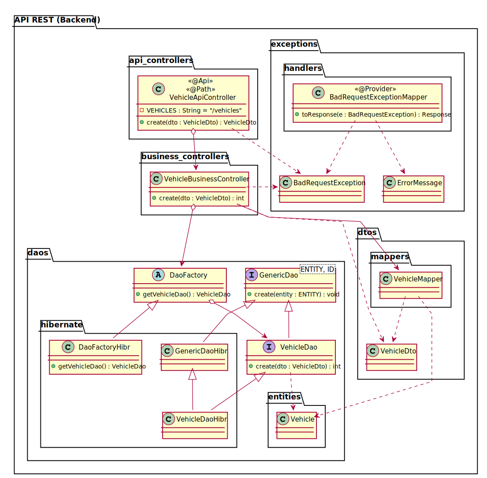

= Analysis View

[#_index]
== Index

* <<_Architecture>>
* <<_UserCaseAnalysis>>
* <<_PackageAnalysis>>

[#_Architecture]
== Architecture
=== Presentation layer

=== Business layer
image::http://www.plantuml.com/plantuml/proxy?src=https://raw.githubusercontent.com/Ruskab/agrimManager/develop/documentation/logicalview/designview/repository/puml/api-layer-web-architecture-packages.puml&fmt=svg[packages REST]

<<_index>>

[#_UserCaseAnalysis]
== Analysis design traceability

<<_index>>

[#_PackageAnalysis]
== Mechanisms

=== Persistence

=== API REST resource

<<_index>>
