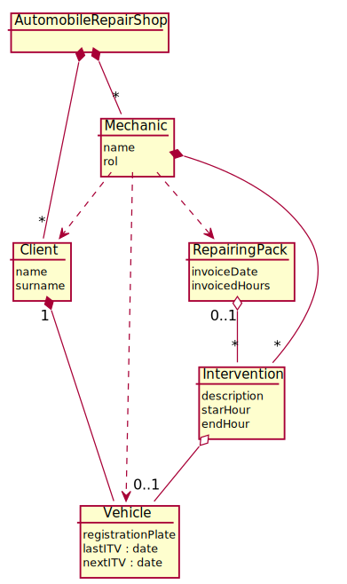
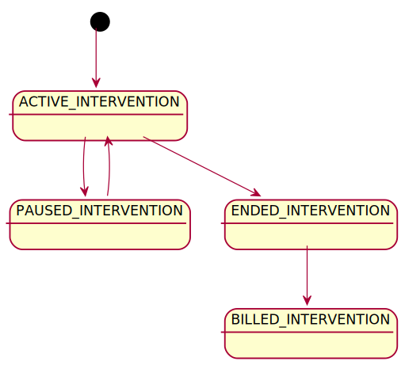

= Domain model

[#_index]
== Index

<<_domainModel>>

<<_interventionFlow>>

[#_domainModel]
== domain Model

<<_index>>

[#_interventionFlow]
== Intervention statuses

<<_index>>

== Glosario de terminos

|===
| Termino | Descripción

| Intervención | trabajo concreto que realiza un mecanico
| Pack de reparación | conjunto de Intervenciones clasificados segun una categoria
| Intervención caffe | trabajo que realiza un mecanico en el taller, no facturable a un cliente
| Mecanico | Empleado del taller que realiza intervenciones
| Cliente | Clientes del taller, que tienen una ficha en el sistema y un conjunto de vehiculos a su nombre
| vehiculo | vehiculos de los clientes, tienen una ficha en el sistema, las intervenciones se realizan a estos vehiculos
| Administrador | Encargado del taller, gestiona a lo mecanicos, factura intervenciones al cliente
|===

== Lista de caracteristicas
* Ecosistema JavaEE
* Aplicación Web

|===
| Requisito no Funcional | Descripcion

| RNF1
| RNF2

| Pocos clicks
| Usable desde ordenador y el movil
|===

