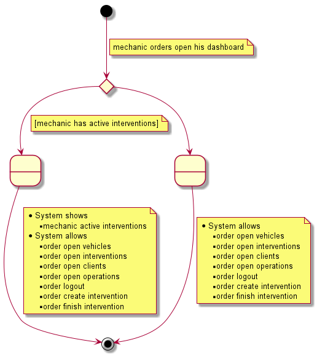
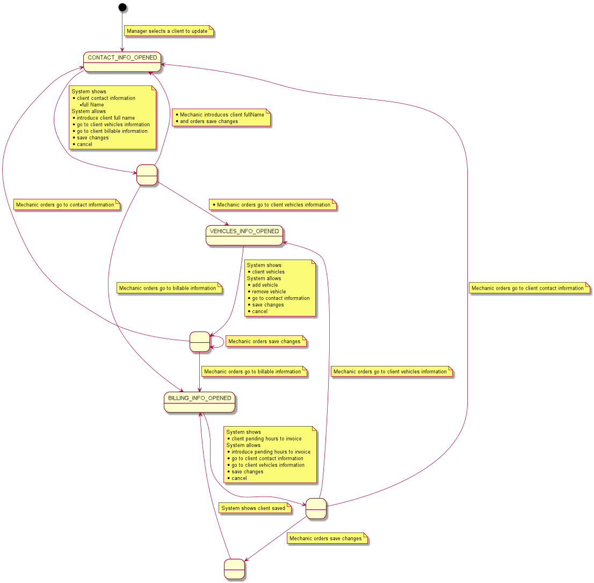

= USE CASES SPECIFICATIONS

[#_index]
== Index

<<_general>>

<<_vehicles>>

<<_clients>>

<<_interventions>>

<<_mechanics>>

[#_general]
== General
=== open Dashboard

<<_index>>

[#_vehicles]
== Vehicles management
=== create vehicle
image::png/createVehicle.png[]
<<_index>>

[#_clients]
== Clients management
=== update Client

<<_index>>

[#_interventions]
== Interventions management
<<_index>>

[#_mechanics]
== Mechanics management
<<_index>>

