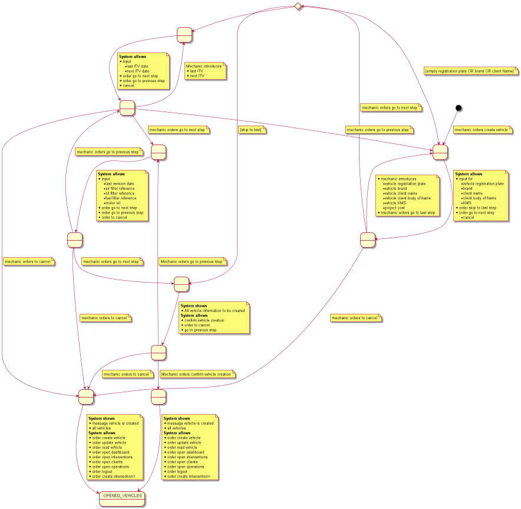

= USE CASES SPECIFICATIONS

[#_index]
== Index

<<_vehicles>>

<<_clients>>

<<_interventions>>

<<_mechanics>>

[#_vehicles]
== Vehicles management
=== create vehicle

<<_index>>

[#_clients]
== Clients management
<<_index>>

[#_interventions]
== Interventions management
<<_index>>

[#_mechanics]
== Mechanics management
<<_index>>

